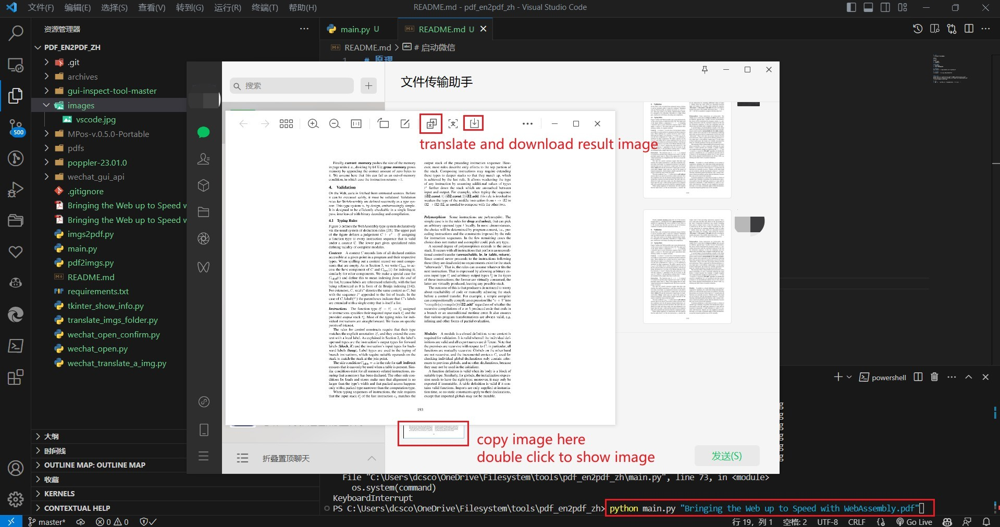
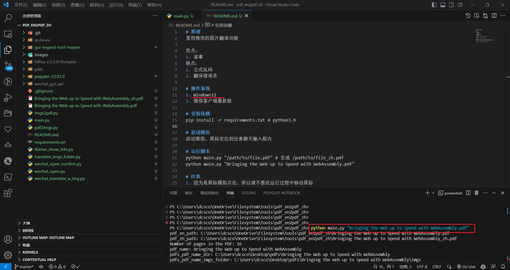

# 原理
复用微信的图片翻译功能

优点：
1. 省事
缺点：
1. 公式乱码
2. 翻译错误多

# 操作系统
1. Windows11
2. 微信客户端最新版

# 安装依赖
pip install -r requirements.txt # python3.9

# 启动微信
启动微信，鼠标定位到任意聊天输入框内

# 运行脚本
python main.py "/path/to/file.pdf" # 生成 /path/to/file_zh.pdf
python main.py "Bringing the Web up to Speed with WebAssembly.pdf"

# 注意
1. 因为是鼠标模拟点击，所以请不要在运行过程中移动鼠标